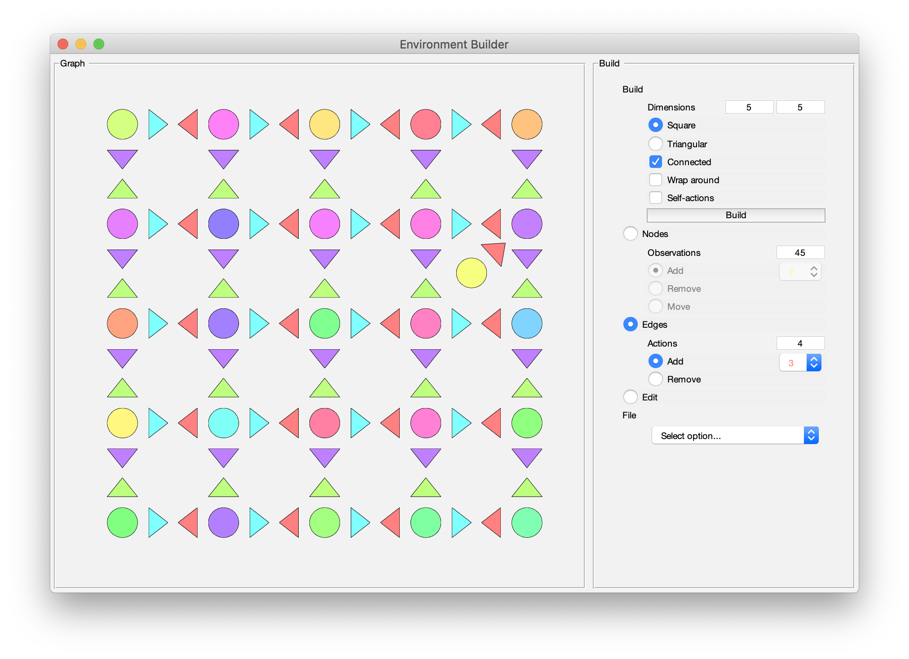

# World Builder

<!-- TABLE OF CONTENTS -->
## Table of Contents

* [About](#about)
* [GUI](#gui)
	* [Build](#build)
	* [Nodes](#nodes)
	* [Edges](#edges)	
	* [Edit](#edit)		
* [Output](#output)
* [Contact](#contact)
* [Acknowledgements](#acknowledgements)


<!-- ABOUT THE PROJECT -->
## About

This is a Matlab GUI for specifying Markov Decision Processes (MDPs), for use as environments in the Tolman Eichenbaum Machine ([https://github.com/jbakermans/torch_tem](https://github.com/jbakermans/torch_tem)) or to model all kinds of reinforcement learning problems. The GUI considers MDPs as graphs, where each node is a state, and each edge is a possible transition between states as a consequence of an action. It allows for building up a graph from scratch, or generating a regular graph and editing it into the desired structure. A structured description of the resulting graph can be saved as a .mat or .json file.


<!-- GUI -->
## GUI

Run the GUI by cloning the repo
Clone the repo
```sh
git clone https://github.com/jbakermans/torch_tem.git
```
then opening Matlab in the repo's directory, and running
```
WorldBuilder
```
The gui will open with an empty world initialised. 

The image below shows an example of the initial state of the GUI.

<!--  -->


### Build

The ```Build``` section generates regular graphs. You can specify dimensions of the regular graph (when one of the dimensions equals 1, the resulting graph will be a loop), whether nodes are connected by edges, whether actions wrap around (e.g. going east from the east-most nodes take you to the west-most node), and whether the graph contains self-actions (an edge going from a node to itself). After selecting the desired setup, click the ```Build``` button to generate a graph.

The image below shows an example of a 5x5 connected square grid graph, with no wrap-around or self-actions.

<!--  -->


### Nodes

Selecting the ```Nodes``` section allows for manipulating the graph nodes. Each node has an associated observation; the total number of possible observations can be set here. Then there is the option to add a node (click anywhere on the graph to add a node), remove a node (click on a node to remove it), or move a node (click on a node you want to move, then click a new location - moving doesn't change the topological properties of the graph, but does change the way it looks for plotting).

The image below shows an example where a yellow node has been added to the regular graph.

<!--  -->


### Edges

The ```Edges``` manipulates graph edges. The total number of actions (e.g. four in the case of a square grid graph with no self-actions: north, east, south, and west) can be specified here. There is an option to add an edge (click on the source node, then on the target node to add an edge between the two) and removing an edge (click on the source node, then on the target node to remove an edge between the two).

The image below shows an example where a red edge has been added from the new yellow node to the purple node.

<!--  -->


### Edit

Probabilities that specify policy and transitions can be edited via the ```Edit``` section. When selected, clicking a node will bring up a dialog for setting probabilities. The policy is a probability distribution over all available actions; the transition probability given an action specifies how likely each possible outcome is. To have multiple possible transitions for an action, first use the Add option under Edges to add different transitions for the same action from a given node. It will then be possible to set the probabilities of each transition in the Edit dialog.

The image below shows an example Edit dialog for setting action and transition probabilities.

<!--  -->


<!-- OUTPUT -->
## Output

A graph can be saved by selecting Save under the ```File``` section, as a Matlab struct in a .mat file, or a JSON object in a .json or .txt file. Either way, the output is a structured object with the following fields:

- ```n_locations```: number of nodes
- ```n_observations```: number of observations
- ```n_actions```: number of actions
- ```adjacency```: adjacency matrix (1 if nodes are adjacent, 0 if not)
- ```locations```: list of details of each individual node
	- ```id```: node ID
	- ```observation```: node observation
	- ```x```: node x coordinate for plotting purposes (no functional consequences)
	- ```y```: node y coordinate for plotting purposes (no functional consequences)	
	- ```in_locations```: nodes from which this node can be reached
	- ```in_degree```: number of locations from which this node can be reached
	- ```out_locations```: nodes that can be reached from this node
	- ```out_degree```: number of nodes that can be reached from this node
	- ```actions```: list of detail for each individual action from this node
		- ```id```: action ID
		- ```transition```: transition probability across outcome nodes given this action at this node
		- ```probability```: probability of taking this action at this node (policy)

<!-- CONTACT -->
## Contact

[Jacob Bakermans](http://users.ox.ac.uk/~phys1358/) - jacob.bakermans [at] gmail.com

<!-- ACKNOWLEDGEMENTS -->
## Acknowledgements

The included circulant function was written by John D'Errico and provided on the [Matlab File Exchange](https://uk.mathworks.com/matlabcentral/fileexchange/22858-circulant-matrix).